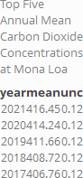

Case Study 08
================
Bobby Decker
10/27/2022

\#install.packages(“kableExtra”) \#install.packages(“magick”)

    ## 
    ## -- Column specification -------------------------------------------------------------------------------------------------------
    ## cols(
    ##   year = col_double(),
    ##   mean = col_double(),
    ##   unc = col_double()
    ## )

``` r
ggplot(mauna_mean, aes(year, mean))+
  geom_line(color="red", size=1.75)+
  labs(
    title="Annual Mean Carbon Dioxide Concentration",
    subtitle = "1959 - Present",
  )+
  xlab("Year")+
  ylab("Mauna Loa Annual Mean CO_2 (ppm)")
```

<!-- -->

``` r
top5_table<-arrange(mauna_mean, desc(mean))[1:5, ]
knitr::kable(top5_table, caption = 'Top Five Annual Mean Carbon Dioxide Concentrations at Mona Loa',
col.names = c("year", "mean", "unc")) %>%
as_image(width = 10,file = "table.png")
```

<!-- -->

\#rmarkdown::render(“path/to/file.Rmd”,output_format = “all”)
